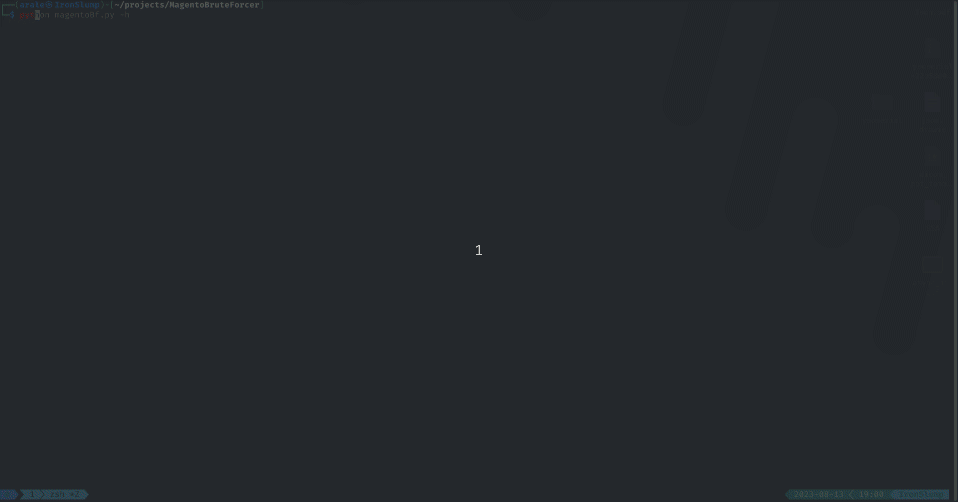

# Yet another Magento Login Bruteforcer

Just for convenience and as a PoC.


## Tested with

This script is tested against:
- **Magento ver. dev-2.4-develop**
- python **3.11.4**


## How it works

```
python magentoBf.py -h

usage: magentoBf.py [-h] [-u U] [-w W] url

Yet another Magento login Bruteforce script.

positional arguments:
  url         The url where the Magento login is located

options:
  -h, --help  show this help message and exit
  -u U        The username to try to brute force the password. Defaults to admin
  -w W        The password wordlist fullpath to use

```

## Demo

Created for and used with **Ignition** box in **HTB**.


